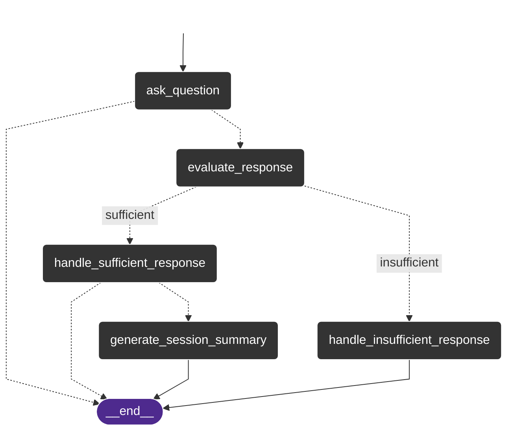

# QuestionnAIre - AI-Powered Medical History Chatbot
## PowerPoint Presentation

---

## Slide 1: QuestionnAIre

### AI-Powered Medical History Chatbot

**QuestionnAIre** is an intelligent medical history chatbot that conducts structured patient interviews.

**Core Features:**
- Automated patient history taking with predefined question catalogs
- AI-powered answer evaluation and intelligent follow-up questions
- Structured medical summaries
- Multiple question sets (e.g., smoking, general history)
- User-friendly chat interface

**Target Audience:** Medical professionals, clinics, practices

---

## Slide 2: Goal - Why QuestionnAIre?

### The Problem with Traditional Medical History Taking

**Challenges:**
- **Completeness:** No questions can be skipped
- **Red Flags:** Warning signs for dangerous conditions must be identified
- **Standardization:** Doctors use question catalogs for every patient

### Why not a simple form?

**Problems with static forms:**
- Patients often don't understand questions correctly
- Follow-up questions and reformulations are necessary
- No flexibility with unclear answers

**Example:**
```
Doctor: "How much do you smoke?"
Patient: "A little bit."
Doctor: "How many cigarettes per day?"
Patient: "30 per day."
```

**Solution:** Intelligent chatbot with AI-powered follow-up logic

---

## Slide 3: Tech Stack

### Technologies Used

**Frontend:**
- HTML5, CSS3, JavaScript (Vanilla)
- Tailwind CSS for modern design
- Responsive Web Design

**Backend:**
- **Python 3.9+** with FastAPI
- **LangGraph** for workflow management
- **LangChain** for LLM integration
- **Uvicorn** ASGI Server

**LLM Models:**
- OpenAI GPT-4o (Primary model)
- Hugging Face Transformers (Alternative)
- Ollama (Local models)

**Development Tools:**
- **Cursor IDE** in agent mode
- **Claude Sonnet 4** and **Gemini 2.5 Pro** as development assistants
- **UV** for Python package management

---

## Slide 4: Screenshots

### User Interface

**Chat Interface:**
- Clean, modern user interface
- Real-time conversation with medical assistant
- Structured question guidance

**Example Conversation:**
```
Bot: Welcome to QuestionnAIre! I am your medical assistant. 
     To begin, please answer the following question.

     Do you smoke?

User: Yes, sometimes

Bot: Could you please be more specific about your smoking habits? 
     For example, how many cigarettes do you smoke per day or per week?

User: About 10 cigarettes per day

Bot: Thank you for clarifying. How much do you smoke?
```

**Final Summary:**
- Numbered list of all questions and answers
- Structured medical summary
- Exportable results

---

## Slide 5: Code Architecture

### LangGraph Workflow



### Question Set Example (JSON)

```json
{
  "id": "smoking_status",
  "question": "Do you smoke?",
  "criteria": [
    "Must clearly state yes or no",
    "Should specify current smoking status",
    "Can include type of smoking (cigarettes, cigars, pipes, etc.)"
  ],
  "category": "lifestyle",
  "required": true
}
```

### Workflow Properties:
- **Strict Workflow:** Defined rules, not a free agent
- **State-based:** Persistent conversation
- **Retry Logic:** Intelligent follow-up questions for incomplete answers
- **Modular:** Interchangeable question sets

---

## Slide 6: Stretch Goals

### Future Extensions

**🤖 AI-assisted Question Set Generation**
- Automatic creation of question catalogs
- Adaptation to specialized medical areas
- Personalized question sets based on patient profiles

**🖥️ Local Models**
- Fully offline-capable version
- Privacy-compliant solution for sensitive environments
- Integration with local LLM models (Ollama)

**🎤 Voice Mode**
- Voice-based interaction
- Automatic speech recognition and synthesis
- Accessible operation for all patient groups

**📊 Advanced Analytics**
- Statistical analysis of medical history data
- Trend analysis and health patterns
- Integration with existing practice management systems

---

## Technical Details

### Project Structure
```
anamneseai/
├── backend/
│   ├── graph.py              # LangGraph Workflow
│   ├── models.py             # Data models
│   ├── question_manager.py   # Question management
│   ├── answer_evaluator.py   # AI answer evaluation
│   ├── summary_generator.py  # Summary generation
│   └── smoking_questions.json # Example question set
├── frontend/
│   ├── index.html            # Main page
│   ├── app.js               # Chat logic
│   └── style.css            # Styling
└── presentation/
    └── presentation.md       # This presentation
```

### Deployment
- **Development:** `./start.sh` for local development
- **Production:** FastAPI + Uvicorn Server
- **Dependencies:** UV Package Manager for fast installation 